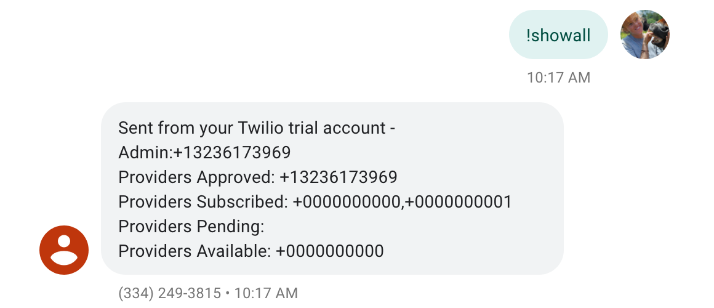
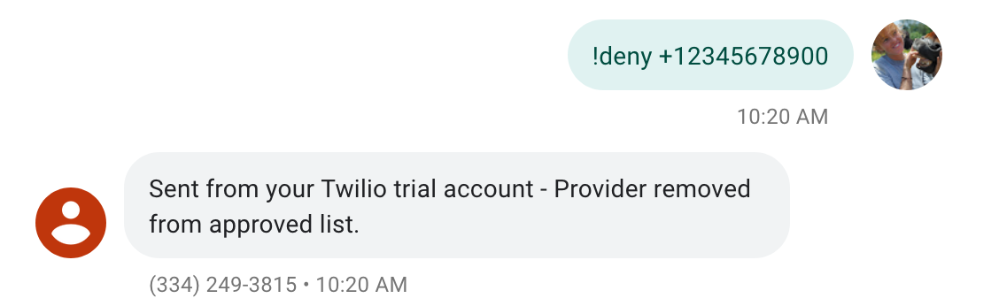
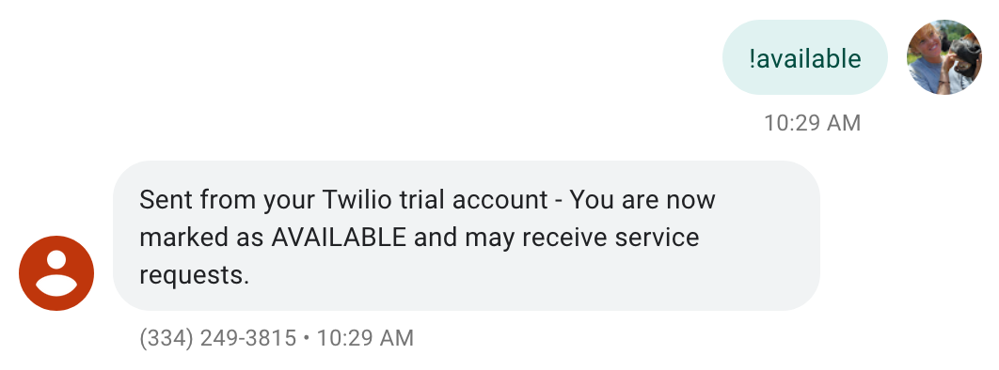
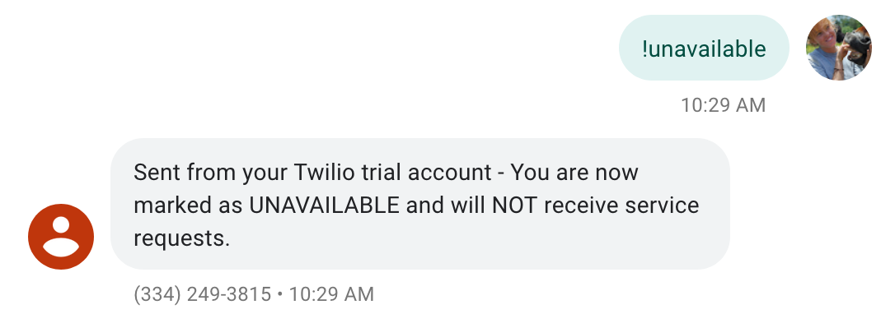
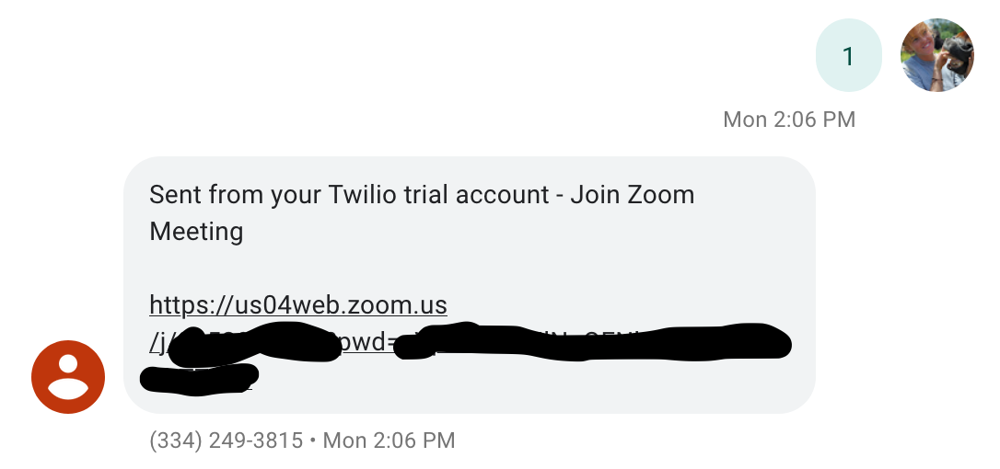

# Express Dispatcher
A fast, minimalistic sms dispatching service using Twilio and Zoom

## How it Works
Originally created for virtual dynamic dispatching of therapists for healthcare workers during the COVID-19 Pandemic. The healthcare workers ("receivers") can request a session from a therapist ("providers") by texting the Twilio number you set up  and then the software will find an available therapist and text each of them a Zoom link so they can have a virtual session. 

The availability of the service providers (eg. therapists) is also maintained by the software and once they are subscribed (requires admin approval) they can mark themselves as available or unavailable at any time.

*Note #1: The code is general enough that it can be used/modified for many dispatch-like applications where there are service providers and service receivers.*

*Note #2: Any of the commands that you text to the service are also configurable. Feel free to use it, modify it, etc.*

#### Administrators
There must be at least one admin number. Admins are responsible for managing the providers and their number will be displayed by the help menu in case providers or receivers have trouble using the service or have a question.

*Admin Command/Text Examples*

| Command | Description | Example Result |
|---|---|---|
| **!showall** | Shows the current list of providers, subscribers, admin, etc. (only accessible to admin) |  |
| **!approve +18505555555** | Approves the +18505555555 number as a provider (only accessible to admin) |  |
| **!deny +18505555555**  | Removed the +18505555555 number from the list of approved providers (only accessible to admin) |  |

#### Service Providers (therapists, etc)
Service providers should text **!subscribe** to subscribe to the service. If they are not already on the admin's list of approved providers, they will have to wait for admin approval.

*Service Providers Command/Text Examples*

| Command | Description | Example Result |
|---|---|---|
| **!subscribe** | This will subscribe you as a service provider (Note: the admin will have to approve you)  |  |
| **!unsubscribe** | This will unsubscribe you as a service provider |  |
| **!available**  | This will mark you as available so you may be selected to provide your virtual/Zoom service (ie start a therapy session, etc) |  |
| **!unavailable**  | This will mark you as unavailable so you will NOT be selected to provide your service. Note that you will will remain subscribed but unavilable. |  |

#### Service Receivers (healthcare workers, etc)
Service receivers are the healthcare workers or whoever is receiving the virtual service.

*Service Receiver Command/Text Examples*

| Command | Description | Example Result |
|---|---|---|
| **0** | This will cancel any pending service requests.  |  |
| **1** | This will start a service request. |  |

## Getting Started

**Technologies**

* [Twilio](https://www.twilio.com/)
* [Node.js](https://nodejs.org/en/) + [Express.js](https://expressjs.com/)
* [Zoom](https://zoom.us/)

### Setup Instructions
*Note: You will need a paid version of Twilio for this to work because the free trail version only allows usage/verification of 1 number but you can test it and play with it for free. Btw-Twilio is cheap*

#### Step 0: Setup Twilio
Create a Twilio account and get a Twilio nmber

#### Step 1: Setup Server
You can use whatever server (heroku, aws, etc) or serverless (serverless, etc) setup you want for this...make a decision based on your application needs.

`config.js` includes comtomizations for messages, etc.

Don't forget to add your Twilio credentials to your `.env`

If you are just testing you can use ngrok which comes setup by default with Twilio.
```bash
twilio login
twilio phone-numbers:update "+13342493815" --sms-url="https://localhost/sms"
```

Install [twilio-cli](https://www.twilio.com/docs/sms/quickstart/node#install-the-twilio-cli) also


Run script using 
```bash
node app.js
```

# Next Steps (notes for me)
* Never got around to adding a front end web interface for easy setup without the need for a developer to spin up a server, probably a nice feature to add.

* Release version 1.0 after testing and completing TODOs in src.

* Other TODO's including writing test scripts, etc all in src